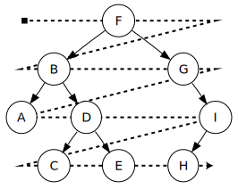

# Tree traversal

## Nice to solve before

[Queue](../../../queue/basic/README.md)

## Instructions

Traverse [tree](https://en.wikipedia.org/wiki/Tree_(data_structure)) using `Breath-First` traversal.

Implement breath-first traversal - visit every node on a level before going to a lower level.



## Examples

```ruby
# ---------Tree------------
#
#           A
#         /   \
#        B     C
#
# --------------------------


tree = BinarySearchTree.new
tree.add('A')
tree.add('B')
tree.add('C')

traverse_breadth_first(tree) # ['A', 'B', 'C']
```

